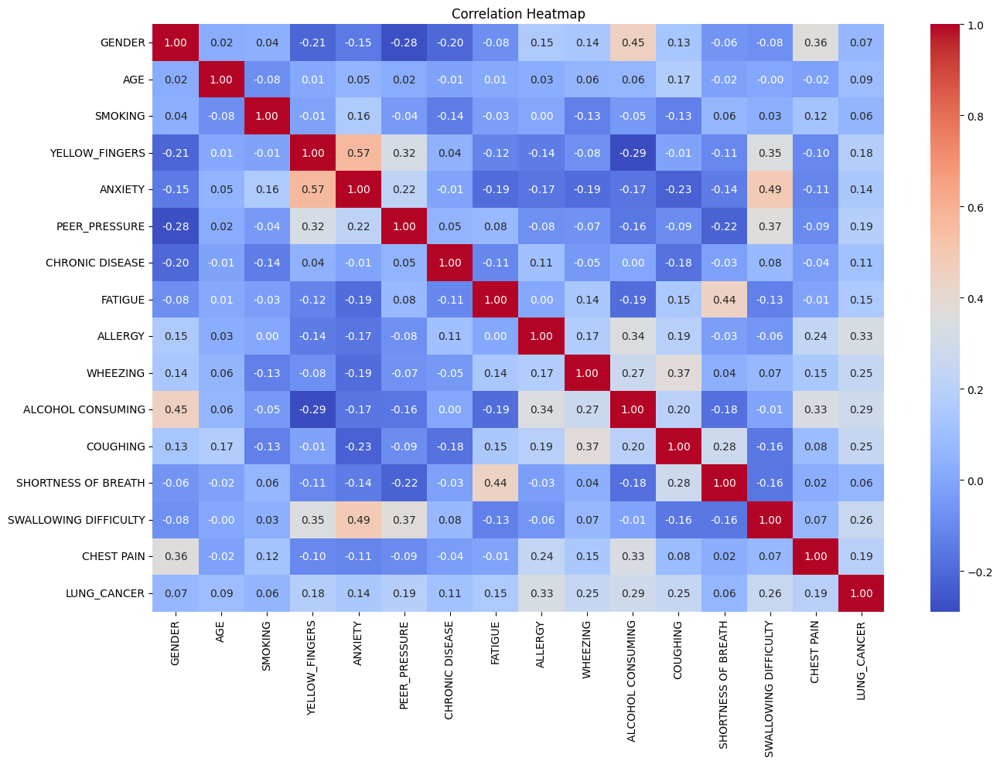

# Lung Cancer Detection Using Machine Learning

A supervised machine learning project for detecting the presence or absence of lung cancer using patient survey and clinical risk-factor data.

## 📌 Project Overview

This project applies supervised machine learning classification techniques to predict whether a patient is likely to have lung cancer based on clinical attributes and associated risk factors.

Three classification algorithms were implemented and compared:

- Logistic Regression
- Decision Tree
- Random Forest

The models were trained and evaluated using the same dataset and test set to provide a fair comparison.

---

## 🎯 Problem Statement

Lung cancer detection can benefit from analyzing patient-related risk factors and symptoms.

The objective of this project is to build a binary classification system that predicts:

- **1 → Lung Cancer Detected**
- **0 → No Lung Cancer Detected**

---

## 📊 Dataset

The project uses the **Lung Cancer Survey Dataset**, containing:

- **309 patient records**
- **15 input features**
- **1 target variable**
- **2 target classes**
- No missing values

The dataset contains patient attributes and risk factors such as:

- Gender
- Age
- Smoking
- Yellow Fingers
- Anxiety
- Peer Pressure
- Chronic Disease
- Fatigue
- Allergy
- Wheezing
- Alcohol Consuming
- Coughing
- Shortness of Breath
- Swallowing Difficulty
- Chest Pain

### Target Variable

`LUNG_CANCER`

| Original Value | Encoded Value |
|---|---:|
| YES | 1 |
| NO | 0 |

---

## 🔄 Data Preprocessing

The following preprocessing steps were performed:

1. Dataset was loaded using Pandas.
2. Input features and target variable were separated.
3. Categorical values were converted into numerical values.
4. `GENDER` was encoded as:
   - M → 1
   - F → 0
5. Binary features were represented numerically.
6. The final dataset was converted into numerical form suitable for machine learning models.

---

## 📈 Exploratory Data Analysis

A correlation heatmap was generated to analyze relationships between the dataset features and the target variable.

### Correlation Heatmap



---

## 🧠 Model Architecture

The project follows the following machine learning pipeline:

```text
Patient Dataset
       ↓
Data Preprocessing
       ↓
Feature Encoding
       ↓
Train-Test Split
       ↓
 ┌───────────────┬───────────────┬───────────────┐
 ↓               ↓               ↓
Logistic       Decision        Random
Regression      Tree           Forest
 ↓               ↓               ↓
 └───────────────┴───────────────┘
                 ↓
          Model Evaluation
                 ↓
      Accuracy / Precision /
       Recall / F1 Score
                 ↓
       Final Model Selection

⚙️ Train-Test Split

The dataset was divided using an 80:20 train-test split.

Training records: 247
Testing records: 62
random_state = 42

The same test set was used to evaluate all three models.

🤖 Machine Learning Models
1. Logistic Regression

Logistic Regression was used as a baseline classification model for predicting the binary target variable.

2. Decision Tree

A Decision Tree classifier was trained to learn decision rules from the patient features.

3. Random Forest

Random Forest combines multiple decision trees to produce a more robust classification model.

It was selected as the final model after comparing the performance of all three algorithms.

📊 Model Results
Model	Accuracy	Precision	Recall	F1 Score
Logistic Regression	96.77%	98.33%	98.33%	98.33%
Decision Tree	95.16%	98.31%	96.67%	97.48%
Random Forest	96.77%	98.33%	98.33%	98.33%
Accuracy Comparison

Overall Model Performance

🔍 Confusion Matrices

Confusion matrices were generated separately for all three classification models to examine correct and incorrect predictions.

🌲 Random Forest Feature Importance

Feature importance was analyzed using the Random Forest model to identify which features contributed most to the model's predictions.

🏆 Final Model

Random Forest was selected as the final model.

Final Accuracy

96.77%

The Random Forest model achieved the highest tied accuracy along with Logistic Regression while providing an ensemble-based approach using multiple decision trees.

🛠️ Technologies Used
Python
Pandas
NumPy
Matplotlib
Seaborn
Scikit-learn
Google Colab
Jupyter Notebook
📁 Project Structure
lung-cancer-detection-ml/
│
├── Lung_Cancer_Detection_ML.ipynb
├── LUNG CANCER DETECTION PBL_ML 251.docx
├── README.md
├── requirements.txt
│
└── images/
    ├── confusionmatrix.png
    ├── correlationheatmap.png
    ├── modelaccuracycomparison.png
    ├── modelperformancecomparison.png
    └── randomforestfeatureimportance.png
▶️ How to Run
1. Clone the repository
git clone https://github.com/dev-adityap/lung-cancer-detection-ml.git
2. Install dependencies
pip install -r requirements.txt
3. Open the notebook

Open:

Lung_Cancer_Detection_ML.ipynb

The notebook can be executed using Jupyter Notebook or Google Colab.

📌 Key Takeaways
The project demonstrates a complete supervised machine learning workflow.
Three classification algorithms were compared.
Logistic Regression and Random Forest achieved 96.77% accuracy.
Decision Tree achieved 95.16% accuracy.
Random Forest was selected as the final model.
Multiple evaluation metrics were used instead of relying only on accuracy.
👨‍💻 Author

Aditya Panna

B.Tech Computer Science & Engineering
